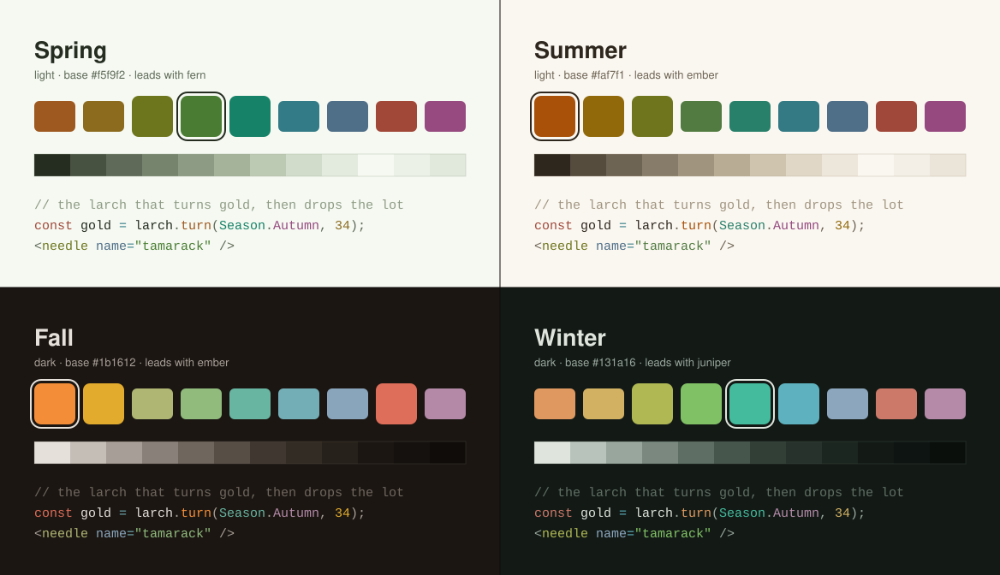
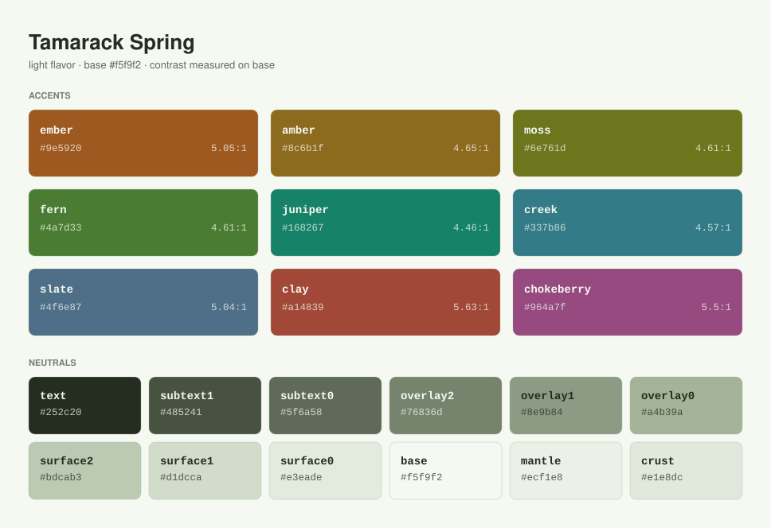
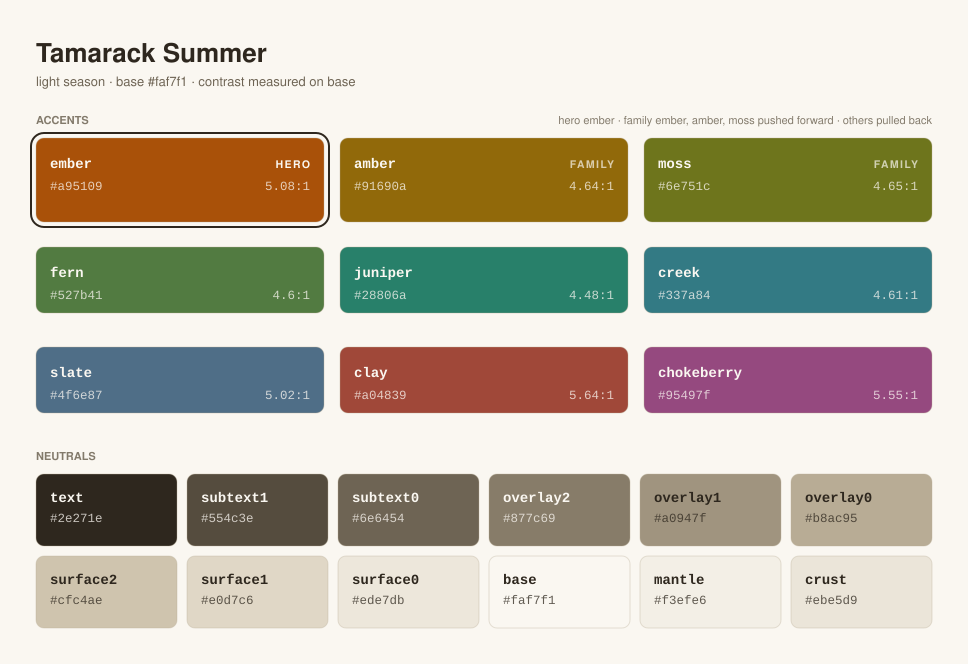
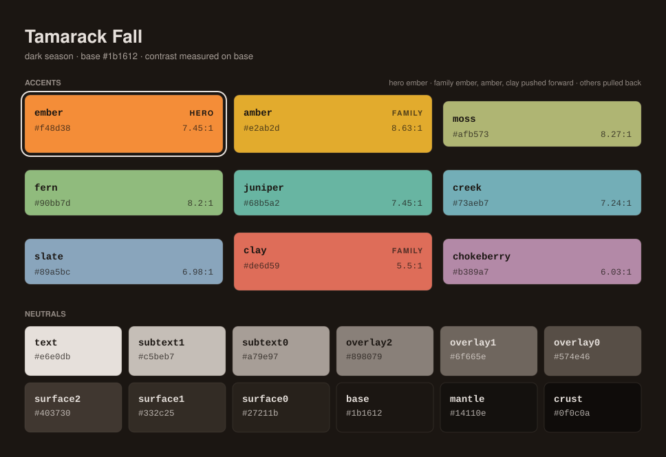
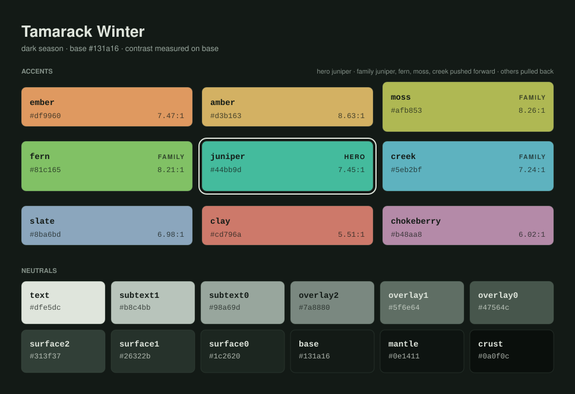
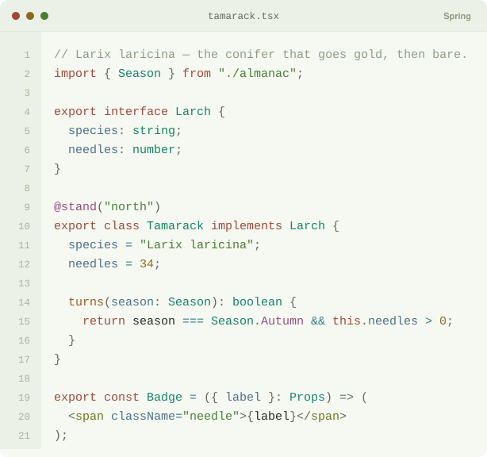
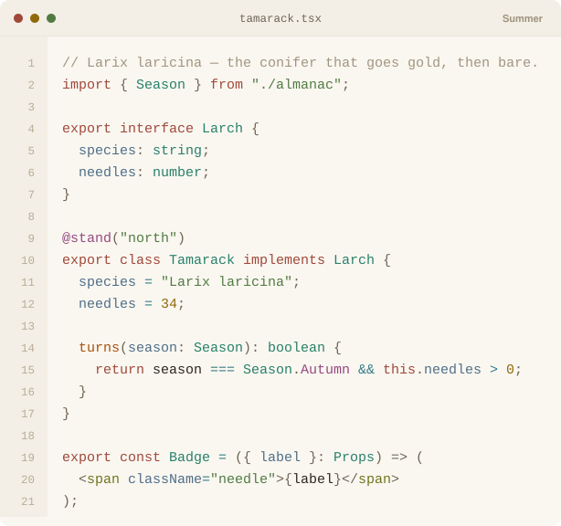
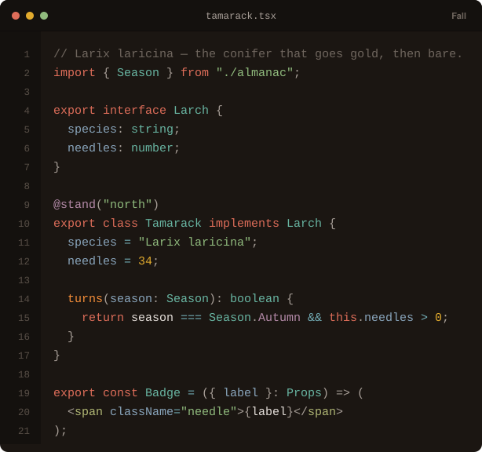
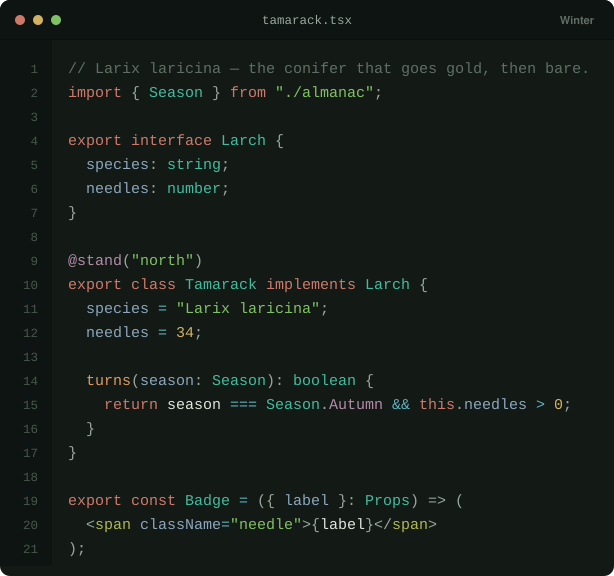

# Tamarack

A warm, nature-derived color palette in four seasons.

Named for the tamarack — the North American larch, a conifer that turns brilliant
gold-orange every autumn before dropping its needles. A green tree that becomes the
hero color and then goes bare, which is a palette that changes with the season in
one word.

No purple, no pink, no electric blue. Nine accents named for things that actually
have these colors, over a twelve-step role-named neutral ramp, in two light seasons
and two dark ones.



## Seasons

| Season | Mode | Base | Text | Leads with | Character |
| --- | --- | --- | --- | --- | --- |
| **Spring** 🌱 | light | `#F5F9F2` | `#252C20` | `fern` | Green-tinted white, 95° |
| **Summer** 🌻 | light | `#FAF7F1` | `#2E271E` | `ember` | Warm white, 40° |
| **Fall** 🍂 | dark | `#1B1612` | `#E6E0DB` | `ember` | Warm brown-black, 28° |
| **Winter** 🌲 | dark | `#131A16` | `#DFE5DC` | `juniper` | Forest black, 146° |

Spring and Summer are the light pair, Fall and Winter the dark one. Within a pair
the split is temperature: Spring and Winter lead green, Summer and Fall lead orange.
So the two axes are mode and warmth, and every combination exists.

## What a season is allowed to change

A season turns exactly one dial on the accents: **saturation**. Two things are held
fixed, and holding them is what keeps four palettes from becoming four unrelated
themes.

- **Hue is locked.** A given token sits at one hue angle in all four seasons —
  `juniper` is 165° in every one of them. The angles are listed in the
  accent table below and nothing in the derivation is allowed to move them; the
  only spread you can measure back off the hex is under a degree of 8-bit rounding.
- **Contrast is locked.** After saturation moves, lightness is solved back until the
  color lands on its reference ratio against its own season's `base`. A token hits
  the same measured contrast in every season of its mode, so no season is the one
  where the strings got hard to read.

Accents in a season's family are pushed to 1.15× saturation and everything else is
pulled to 0.85×, capped at 0.9. That is the whole mechanism. Winter reads green
because its greens are vivid and its warms are muted, not because anything was
recolored or reassigned.

| Season | Pushed forward | Pulled back |
| --- | --- | --- |
| Spring | `fern`, `moss`, `juniper` | `ember`, `amber`, `creek`, `slate`, `clay`, `chokeberry` |
| Summer | `ember`, `amber`, `moss` | `fern`, `juniper`, `creek`, `slate`, `clay`, `chokeberry` |
| Fall | `ember`, `amber`, `clay` | `moss`, `fern`, `juniper`, `creek`, `slate`, `chokeberry` |
| Winter | `juniper`, `fern`, `moss`, `creek` | `ember`, `amber`, `slate`, `clay`, `chokeberry` |

The neutrals move too, but by hue rather than by saturation: Fall rotates the dark
ramp from forest green onto a warm brown, Spring rotates the light ramp from warm
white onto a green-tinted one. Winter and Summer keep their reference ramps unchanged.
Every lightness step is preserved in the rotation, so the ramps stay interchangeable.

## Accents

Δ is the reference contrast against `base`. Both seasons of a mode are solved back to
it, so they match to within hex rounding — the per-season measured values are in
`palette.json` as `contrastOnBase`.

| Token | Hue | Spring | Summer | Δ light | Fall | Winter | Δ dark |
| --- | --- | --- | --- | --- | --- | --- | --- |
| `ember` | 27° | `#9E5920` | `#A95109` | 5.08:1 | `#F48D38` | `#DF9960` | 7.47:1 |
| `amber` | 42° | `#8C6B1F` | `#91690A` | 4.63:1 | `#E2AB2D` | `#D3B163` | 8.62:1 |
| `moss` | 65° | `#6E761D` | `#6E751C` | 4.64:1 | `#AFB573` | `#AFB853` | 8.25:1 |
| `fern` | 102° | `#4A7D33` | `#527B41` | 4.6:1 | `#90BB7D` | `#81C165` | 8.23:1 |
| `juniper` | 165° | `#168267` | `#28806A` | 4.47:1 | `#68B5A2` | `#44BB9D` | 7.45:1 |
| `creek` | 188° | `#337B86` | `#337A84` | 4.59:1 | `#73AEB7` | `#5EB2BF` | 7.28:1 |
| `slate` | 207° | `#4F6E87` | `#4F6E87` | 5.04:1 | `#89A5BC` | `#8BA6BD` | 6.98:1 |
| `clay` | 9° | `#A14839` | `#A04839` | 5.63:1 | `#DE6D59` | `#CD796A` | 5.51:1 |
| `chokeberry` | 318° | `#964A7F` | `#95497F` | 5.52:1 | `#B389A7` | `#B48AA8` | 6.04:1 |

## Neutrals

Role-named rather than color-named, deliberately: `surface0` means the same thing in
every season, whereas a color name would have to be the text in one and the background
in another. The accents carry the identity; the neutrals carry the structure.

| Token | Spring | Summer | Fall | Winter |
| --- | --- | --- | --- | --- |
| `text` | `#252C20` | `#2E271E` | `#E6E0DB` | `#DFE5DC` |
| `subtext1` | `#485241` | `#554C3E` | `#C5BEB7` | `#B8C4BB` |
| `subtext0` | `#5F6A58` | `#6E6454` | `#A79E97` | `#98A69D` |
| `overlay2` | `#76836D` | `#877C69` | `#898079` | `#7A8880` |
| `overlay1` | `#8E9B84` | `#A0947F` | `#6F665E` | `#5F6E64` |
| `overlay0` | `#A4B39A` | `#B8AC95` | `#574E46` | `#47564C` |
| `surface2` | `#BDCAB3` | `#CFC4AE` | `#403730` | `#313F37` |
| `surface1` | `#D1DCCA` | `#E0D7C6` | `#332C25` | `#26322B` |
| `surface0` | `#E3EADE` | `#EDE7DB` | `#27211B` | `#1C2620` |
| `base` | `#F5F9F2` | `#FAF7F1` | `#1B1612` | `#131A16` |
| `mantle` | `#ECF1E8` | `#F3EFE6` | `#14110E` | `#0E1411` |
| `crust` | `#E1E8DC` | `#EBE5D9` | `#0F0C0A` | `#0A0F0C` |

## Roles

A palette without an assignment is just a list of colors. These maps are written
against token names, so they hold for any season.

### Syntax

Identical in all four seasons. The same file has the same shape everywhere; the
season shows up in the colors themselves, not in which token does which job.

| Token | Applies to |
| --- | --- |
| `ember` | Functions, methods |
| `amber` | Numbers |
| `moss` | Tags, attributes, markup structure |
| `fern` | Strings |
| `juniper` | Types, classes, interfaces |
| `creek` | Operators, builtins, escape sequences |
| `slate` | Properties, parameters, fields, JSON keys |
| `clay` | Keywords, storage |
| `chokeberry` | Constants, enum members, decorators, annotations |
| `overlay1` | Comments, doc blocks |
| `subtext0` | Punctuation, delimiters |
| `text` | Identifiers, everything unclaimed |

### Interface

| Token | Applies to |
| --- | --- |
| `hero` | Primary buttons, links, cursor, focus ring, active tab |
| `fern` | Success, added lines in a diff, passing tests |
| `amber` | Warnings, modified lines, pending state |
| `clay` | Errors, deleted lines, destructive actions |
| `creek` | Selection fill, search highlight, info state |
| `slate` | Secondary links, metadata, breadcrumbs |
| `chokeberry` | Constants and enum members in UI chrome |
| `base` | Editor and page background |
| `mantle` | Sidebar, gutter, status bar |
| `crust` | Window chrome, deepest recess |
| `surface0` | Panels, inline code, hover fill |
| `surface2` | Borders, dividers, inactive tab |
| `overlay0` | Disabled text, placeholder |

`hero` is the one entry that is an alias rather than a token. It resolves to
`fern` in Spring, `ember` in Summer, `ember` in Fall
and `juniper` in Winter, which is how chrome follows the
season without every consumer needing a per-season branch.

## Previews

Every preview below is an SVG generated from `palette.json` by
`assets/build.py` — nothing here is a screenshot, so the images cannot drift
from the palette they document.

### Swatches

Each accent carries its measured contrast against its own season's `base`.









### Syntax

The same file in all four seasons, colored strictly by the role table above.









## ANSI 16

All sixteen slots map to real palette tokens. `chokeberry` exists because ANSI
demands a magenta and the original eight accents had no honest answer for it.

| Slot | Code | Spring | Summer | Fall | Winter | From |
| --- | --- | --- | --- | --- | --- | --- |
| black | 0 | `#485241` | `#554C3E` | `#332C25` | `#26322B` | subtext1 (light) / surface1 (dark) |
| red | 1 | `#A14839` | `#A04839` | `#DE6D59` | `#CD796A` | clay |
| green | 2 | `#4A7D33` | `#527B41` | `#90BB7D` | `#81C165` | fern |
| yellow | 3 | `#8C6B1F` | `#91690A` | `#E2AB2D` | `#D3B163` | amber |
| blue | 4 | `#4F6E87` | `#4F6E87` | `#89A5BC` | `#8BA6BD` | slate |
| magenta | 5 | `#964A7F` | `#95497F` | `#B389A7` | `#B48AA8` | chokeberry |
| cyan | 6 | `#337B86` | `#337A84` | `#73AEB7` | `#5EB2BF` | creek |
| white | 7 | `#8E9B84` | `#A0947F` | `#C5BEB7` | `#B8C4BB` | overlay1 (light) / subtext1 (dark) |
| bright black | 8 | `#5F6A58` | `#6E6454` | `#403730` | `#313F37` | — |
| bright red | 9 | `#BA5342` | `#B85342` | `#E38575` | `#D58F83` | — |
| bright green | 10 | `#58953D` | `#60914C` | `#A3C693` | `#94CB7D` | — |
| bright yellow | 11 | `#A78025` | `#B07F0C` | `#E6B74A` | `#DABE7D` | — |
| bright blue | 12 | `#5B7F9C` | `#5B7F9C` | `#9EB5C8` | `#A0B6C9` | — |
| bright magenta | 13 | `#AB5692` | `#AB5492` | `#C09DB6` | `#C19EB7` | — |
| bright cyan | 14 | `#3C919E` | `#3C909C` | `#89BBC2` | `#76BDC8` | — |
| bright white | 15 | `#76836D` | `#877C69` | `#E6E0DB` | `#DFE5DC` | — |

Bright is the normal color lifted in lightness, except at the neutral ends, where
black and white step to the adjacent rung of the ramp so they stay on the same
ladder the rest of the UI is built from.

## Usage

### CSS

`tamarack.css` defines every color as a custom property, plus a paired `-rgb`
triplet for alpha composition. It resolves across all three theme states: the bare
`:root` carries Spring, `prefers-color-scheme` swaps to Winter unless a light
season is explicitly stamped, and an explicit `[data-theme]` stamp wins in either
direction.

```css
@import "tamarack.css";

.button {
  background: var(--tm-hero);
  color: var(--tm-base);
}

.selection {
  background: rgb(var(--tm-creek-rgb) / 0.25);
}
```

Writing chrome against `--tm-hero` rather than a named accent is what makes it
re-point on its own: the same button is fern in Spring and juniper in Winter.

Force a season with `<html data-theme="winter">`, and so on for each of
`spring`, `summer`, `fall`, `winter`. `data-theme="dark"` and `data-theme="light"` are
accepted as aliases for Winter and Spring.

### Sass

```scss
@use "tamarack" as *;

.button {
  background: tm("winter", "hero");
}

@each $season in $tamarack-seasons {
  [data-theme="#{$season}"] .button { background: tm($season, "hero"); }
}
```

`$tamarack-seasons`, `$tamarack-light` and `$tamarack-dark` are exported so you can
loop over the seasons without hardcoding their names.

### JSON

The season definitions at the top of `gen.py` are the source of truth.
`palette.json` is generated from them, and is what every port reads — so it is
the stable contract for anything outside this repo. Every color carries `hex`,
`rgb`, `hsl`, `accent`, and `contrastOnBase`; each season also carries `hero`,
`family`, `character`, and a full `ansiColors` block with normal and bright
variants and their codes.

```json
{
  "winter": {
    "dark": true,
    "hero": "juniper",
    "family": ["juniper", "fern", "moss", "creek"],
    "colors": {
      "juniper": {
        "hex": "#44BB9D",
        "rgb": { "r": 68, "g": 187, "b": 157 },
        "accent": true,
        "contrastOnBase": 7.45
      }
    }
  }
}
```

## Regenerating

`palette.json`, `tamarack.css`, `tamarack.scss` and this README are all generated.
Edit the season definitions at the top of `gen.py`, then:

```bash
python3 gen.py
python3 assets/build.py
python3 sublime-text/build.py
python3 ghostty/build.py
python3 slack/build.py
```

`gen.py` runs first because the previews and every port build read the
`palette.json` it writes.

No dependencies beyond the Python standard library.

## Notes on the design

- **Only two flavors were ever chosen by eye.** One dark reference and one light
  reference, twenty-one colors each. All four seasons are derived from those two, so
  a retune is a change to one saturation multiplier rather than to thirty-six hex
  values, and the hue lock cannot quietly break.
- **Contrast is measured, not assumed.** Every accent carries its ratio against its
  own season's `base`. The light seasons span roughly 4.5–5.6:1 and the dark ones
  5.5–8.6:1 — light is inherently flatter, which is a property of dark accents on a
  light ground rather than an oversight.
- **Saturation, not reassignment, carries the season.** It would have been easier to
  make Winter green by pointing the string color at `juniper`. That breaks muscle
  memory across seasons for no gain, so the role tables are identical everywhere and
  the palette itself does the work.
- **JSON keys map to `slate`, not `moss`.** `moss` and `fern` sit 37° apart, which is
  fine in prose and not fine in JSON, where keys and string values alternate on every
  line. Fixed by role assignment rather than by moving hues.
- **`amber` does numbers and warnings only.** Constants moved to `chokeberry` when it
  joined, so no token carries three unrelated meanings.

## License

MIT. See [LICENSE](LICENSE).
